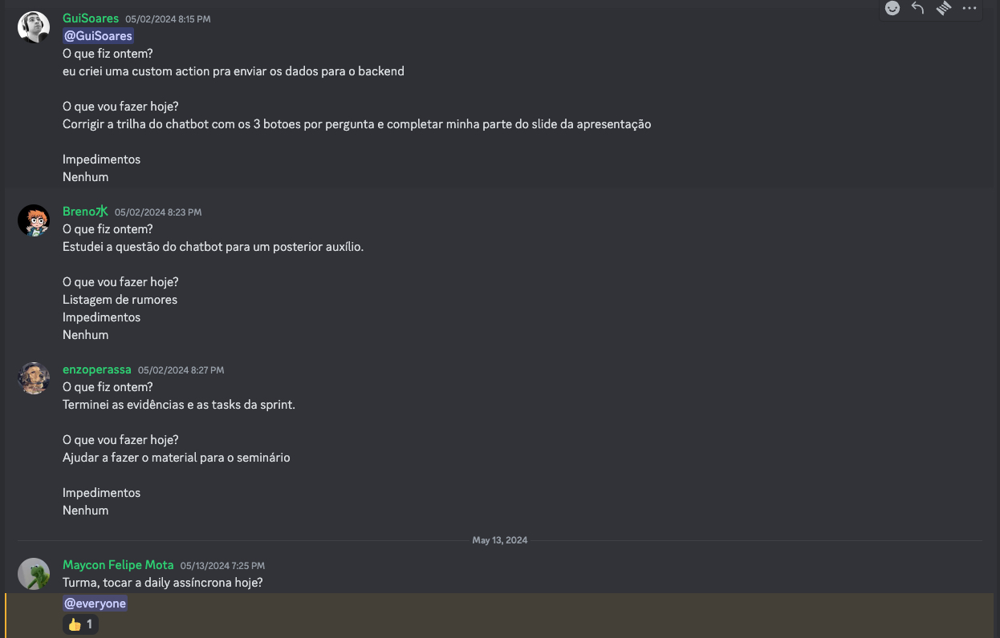

As reuniões diárias (Dailies) tiveram o objetivo de manter a equipe atualizada sobre o andamento do projeto, identificar possíveis problemas e ajustar o planejamento de acordo com as necessidades do projeto. As reuniões diárias foram realizadas de forma híbrida, ou seja, presencialmente e remotamente, através do Discord, com duração de 15 minutos.

*Imagem ilustrativa de uma Daily assíncrona no Discord. (Fonte: Autores, 2024).*

## Reuniões 

=== "Março/2024"

    | Data da Reunião | Membro    | Frequência | O que foi feito no dia anterior                                                                                                                                                                                                   | O que será feito hoje                                                                                                                                                                                                                                                                                                                                                                                                      | Dificuldades                                                                                                                                                                                                                                                                                                   |
    | --------------- | --------- | ---------- | --------------------------------------------------------------------------------------------------------------------------------------------------------------------------------------------------------------------------------- | -------------------------------------------------------------------------------------------------------------------------------------------------------------------------------------------------------------------------------------------------------------------------------------------------------------------------------------------------------------------------------------------------------------------------- | -------------------------------------------------------------------------------------------------------------------------------------------------------------------------------------------------------------------------------------------------------------------------------------------------------------- |
    | 20/03/2024      | Maycon    | Presente   | Participei Reunião de pre- game no CIEVS, anteriormente fiz spike sobre Chatbot                                                                                                                                                   | Hoje irei trabalhar nas questões de esteira para o frontend quanto para o backend, além de tentar dar uma força nos componentes de prototipação                                                                                                                                                                                                                                                                         | Nenhum                                                                                                                                                                                                                                                                                                         |
    | 20/03/2024      | Lameirão  | Presente   | Criação do board do Miro do Lean Inception e Reunião de pre-game no CIEVS                                                                                                                                                         | Configuração do Jira (adição de extensão de tempo no Jira) e criação de componentes para o Figma                                                                                                                                                                                                                                                                                                                        | Nenhum                                                                                                                                                                                                                                                                                                         |
    | 20/03/2024      | Sobrinho  | Presente   | Ontem participou da Reunião de pre-game no CIEVS, ontem fez um Spike sobre o Chatbot                                                                                                                                              | Vai olhar questões estruturantes do Backend como autenticações e integração Keycloak                                                                                                                                                                                                                                                                                                                                       | Nenhum                                                                                                                                                                                                                                                                                                         |
    | 20/03/2024      | Guilherme | Presente   | Fez um Spike sobre o Chatbot, participou da Reunião de pre- game no CIEVS                                                                                                                                                         | Criar um chatbot simples pra prova de conceitos usando o Dialogflow. Integrar Dialogflow ao Messenger.                                                                                                                                                                                                                                                                                                                  | Nenhum                                                                                                                                                                                                                                                                                                         |
    | 20/03/2024      | Enzo      | Presente   | Participou da Reunião de pre- game no CIEVS e ontem realizou Spike sobre o Chatbot, descobriu a ChatWoot                                                                                                                       | Vai atacar a parte da prototipação e criação de componentes estilizados juntos com o Lameirão                                                                                                                                                                                                                                                                                                                           | Está preocupa as stacks que estamos traze                                                                                                                                                                                                                                                                      |
    | 20/03/2024      | Breno     | Faltou     | Participou da Reunião de pre- game no CIEVS e ontem realizou Spike sobre o Chatbot                                                                                                                                             | -                                                                                                                                                                                                                                                                                                                                                                                                                          | -                                                                                                                                                                                                                                                                                                              |
    | 21/03/2024      | Maycon    | Presente   | Criou esteiras de CI/CD no Github Actions para o Backend Fez o deploy do Backend Criou esteiras de CI/CD no Github Action para o Frontend Fez o deploy do Frontend                                                    | Participar da reunião de descoberta Analisar protótipo de baixa fidelidade                                                                                                                                                                                                                                                                                                                                              | Nenhum                                                                                                                                                                                                                                                                                                         |
    | 22/03/2024      | Lameirão  | Presente   | - Integrou um time tracker no Jira  Iniciou desenvolvimento do protótipo de baixa fidelidade                                                                                                                                  | Continuar desenvolvimento do protótipo de baixa fidelidade Participar da reunião de descoberta                                                                                                                                                                                                                                                                                                                       | Um pouco de dificuldade co figma                                                                                                                                                                                                                                                                               |
    | 22/03/2024      | Sobrinho  | Presente   | Estudos para a modelagem do backend Estudos para o desenvolvimento do serviço de Autenticação Estudos do next                                                                                                            | - Continuar estudos para implementação do Keycloak                                                                                                                                                                                                                                                                                                                                                                         | Nenhum                                                                                                                                                                                                                                                                                                         |
    | 22/03/2024      | Guilherme | Presente   | Criação de um chatbot simples para a prova de conceitos usando o Dialogflow.                                                                                                                                                   | A equipe decidiu por coletar mais informações com o preponente antes de prosseguir com outras atividades. ——————————————— Vincular o Dialogflow com a página no Facebook. Vincular o Dialogflow ao Messenger da página utilizando o token do aplicativo. Criar um servidor ou utilizar o modulo pro NestJS e conseguir utilizar dos webhooks pra receber e tratar notificações, rotas e intents no backend. | Wit.ai sobre baseline do c plataforma de desenvolvime inteligencia ar gratuito da Me O Dialogflo ser utilizado s para a prova d conceitos? Po eu acho que d criar outro ser simples em no testar. Se ele não utilizado no pr vale a pena eu desprender m tempo nessa t configurando webhooks em backend? |
    | 22/03/2024      | Enzo      | Presente   | Estudando stack de desenvolvimento para front Estudo para o protótipo de baixa fidelidade                                                                                                                                   | - Auxiliar Lameirão com o desenvolvimento do protótipo de baixa fidelidade                                                                                                                                                                                                                                                                                                                                              | - Um pouco d dificuldade co figma                                                                                                                                                                                                                                                                              |
    | 22/03/2024      | Breno     | Presente   | Doente                                                                                                                                                                                                                            | Alinhar com o time o que foi desenvolvido ontem Participar da descoberta                                                                                                                                                                                                                                                                                                                                                | Nenhum                                                                                                                                                                                                                                                                                                         |
    | 22/03/2024      | Maycon    | Presente   | Participei das três das reuniões, criei a visão de contexto (modelo de C4, subi a estrutura no Frontend                                                                                                                          | - Hoje pretendo terminar de montar a estrutura do Frontend, e ajudar na parte do prótipo e definição de UI                                                                                                                                                                                                                                                                                                              | Nenhum                                                                                                                                                                                                                                                                                                         |
    | 26/03/2024      | Lameirão  | Presente   | - Na quinta-feira, mexeu na criação do protótipo de baixa fidelidade, realizou o discovery e fechou o discovery                                                                                                                | Pretende continuar com o protótipo de baixa fidelidade, e da estrutura do administrativo Vai se atualizar do Miro                                                                                                                                                                                                                                                                                                    | Nenhum                                                                                                                                                                                                                                                                                                         |
    | 26/03/2024      | Sobrinho  | Presente   | - Participou das três reuniões (hudson, discovery e pós discovery).                                                                                                                                                            | Hoje pretende terminar a planilha de decisões, além de tentar modelar um rascunho do DDD para tentar entender um pouco mais do problema.                                                                                                                                                                                                                                                                             | Nenhum                                                                                                                                                                                                                                                                                                         |
    | 26/03/2024      | Guilherme | Presente   | - Trabalhou no documento de spike sobre Chatbot e das três reuniões                                                                                                                                                               | Hoje pretende terminar o documento do Spike sobre o chatbot e gostaria de partir para a implementação                                                                                                                                                                                                                                                                                                                   | Nenhum                                                                                                                                                                                                                                                                                                         |
    | 26/03/2024      | Enzo      | Presente   | - Participou das três reuniões                                                                                                                                                                                                    | Hoje pretende se atualizar sobre as tecnologias e discussões que estão no Discord. Quer ajudar o Sobrinho a ver sobre autenticação e sobre DDD                                                                                                                                                                                                                                                                       | Nenhum                                                                                                                                                                                                                                                                                                         |
    | 26/03/2024      | Breno     | Presente   | - Participou das três reuniões, trabalhou no Figma para                                                                                                                                                                           | Pretende ajudar no protótipo em relação ao figma                                                                                                                                                                                                                                                                                                                                                                           | Nenhum                                                                                                                                                                                                                                                                                                         |
    | 26/03/2024      | Maycon    | Presente   | Participou das reuniões com preponentes/complexibilidade                                                                                                                                                                          | Hoje vou auxiliar o Gui a finalizar o documneto do chatbot, ajudar na parte de refinamento das tarefas e caso termine, ajudar o lameirão a fazer a prototipação                                                                                                                                                                                                                                                      | Nenhum                                                                                                                                                                                                                                                                                                         |
    | 27/03/2024      | Lameirão  | Presente   | Participou da reunião com preponente, definiu as principais funcionalidades e identificou funcionalidade que tem mais valor. Também participou do pós-reunião de inception                                                  | Hoje está focado em auxiliar o documento dos chatbots, vai atuar na prototipação de baixa fidelidade da tela de login                                                                                                                                                                                                                                                                                                      | Nenhum                                                                                                                                                                                                                                                                                                         |
    | 27/03/2024      | Sobrinho  | Presente   | Participou das reuniões com preponentes/complexibilidade                                                                                                                                                                          | Hoje deve finalizar a questão da autenticação no Back, e vai dar suporte no estudo de viabilidade do Chatbot                                                                                                                                                                                                                                                                                                            | Nenhum                                                                                                                                                                                                                                                                                                         |
    | 27/03/2024      | Guilherme | Presente   | Participou das reuniões com preponentes/complexibilidade, trabalhou com algumas questões do backend (na autenticação)                                                                                                       | Hoje deve focar no documento de viabilidade do Chatbot                                                                                                                                                                                                                                                                                                                                                                     | Nenhum                                                                                                                                                                                                                                                                                                         |
    | 27/03/2024      | Enzo      | Presente   | Participou das reuniões com preponentes/complexibilidade                                                                                                                                                                          | Hoje pretende ajudar o Lameirão com os protótipos                                                                                                                                                                                                                                                                                                                                                                       | Nenhum                                                                                                                                                                                                                                                                                                         |
    | 27/03/2024      | Breno     | Presente   | Participou da reunião com preponente, definiu as principais funcionalidades e identificou funcionalidade que tem mais valor, também ajudou a verificar a complexibilidade. Também participou do pós-reunião de inception | Hoje vai atuar na atividade de refinamento das tarefas, além de dar suporte na finalização dos baselines.                                                                                                                                                                                                                                                                                                                  | Nenhum                                                                                                                                                                                                                                                                                                         |

=== "Abril/2024"

    | Data da Reunião | Membro    | Frequência            | O que foi feito no dia anterior                                                                                                                                               | O que será feito hoje                                                                                                                                                                                                                             | Dificuldades/                                                      |
    |-----------------|-----------|-----------------------|-------------------------------------------------------------------------------------------------------------------------------------------------------------------------------|---------------------------------------------------------------------------------------------------------------------------------------------------------------------------------------------------------------------------------------------------|--------------------------------------------------------------------|
    | 01/04/2024      | Guilherme | Presente              | Participou da reunião com os proponentes sobre a definição                                                                                                                 | - Participar do alinhamento do backlog, participar da reunião com o Hudson, elaboração da Planning,                                                                                                                                            | Nenhum                                                             |
    | 01/04/2024      | Sobrinho  | Presente              | - Reunião com os proponentes                                                                                                                                                  | - reunião hudson. - continuar autenticação backend. - finalizar a baseline.                                                                                                                                                                       | Nenhum                                                             |
    | 01/04/2024      | Lameirão  | Presente              | - Reunião com os proponentes                                                                                                                                                  | - Dividir as tarefas e começar o backlog de produto. Pra antes da planning ter estórias mais detalhadas. - Continuar o protótipo. - Reunião hudson.                                                                                               | Nenhum                                                             |
    | 01/04/2024      | Breno     | Presente              | - Reunião com os proponentes                                                                                                                                                  | - participar do alinhamento do backlog. - se organizar com a glr do back. - reunião hudson.                                                                                                                                                 | Nenhum                                                             |
    | 01/04/2024      | Maycon    | Presente              | - Reunião com os proponentes. - baseline do front. - escopo da tela de login e dashboard.                                                                                  | - Começar a mexer com a autenticação. Focar o jwt ficar autenticado. - Entrar no processo do protótipo. Focar tela de login. Reunião hudson. - planning.                                                                                 |                                                                    |
    | 01/04/2024      | Enzo      | Presente              | - Reunião com os proponentes                                                                                                                                                  | - protótipo. - reunião hudson                                                                                                                                                                                                                     | Nenhum                                                             |
    | 02/04/2024      | Guilherme | Presente              | - Ontem trabalhou nas questões do Backlog                                                                                                                                     | Hoje pretende entrar com a Code Selling e ver como conseguir uma conta da WhatsApp Business API                                                                                                                                                | Não está conseguindo acesso a WhatsApp Business API             |
    | 02/04/2024      | Sobrinho  | Presente              | Ontem participou da Planning, com a reunião com o Hudson                                                                                                                      | Hoje pretende terminar as questões do Controller e Users já com testes                                                                                                                                                                         | Nrnhum                                                             |
    | 02/04/2024      | Lameirão  | Presente              | Ontem participou da Planning e reunião com o Hudson, ontem enviou todos os artefatos ao Hudson                                                                             | Hoje vai focar no protótipo de baixa fidelidade dos usuários (tela de listagem, cadastro e edição)                                                                                                                                          | Nenhum                                                             |
    | 02/04/2024      | Breno     | Presente              | Ontem participou da Planning e reunião com o Hudson                                                                                                                           | Hoje pretende ver as questões do WhatsApp junto ao Guilherme e vai focar nas questões de como implementar o ChatBot                                                                                                                            | Nenhum                                                             |
    | 02/04/2024      | Maycon    | Presente              | Ontem participou da Planning e reuniao com o Hudson                                                                                                                           | Hoje pretendo focar nas páginas de Login e Resetar Senha do FrontEnd e entregar com testes a página mockada                                                                                                                                    | Nenhum                                                             |
    | 02/04/2024      | Enzo      | Presente              | Ontem participou da Planning e da reunião com o Hudson, também participou da Retro, alinhou sobre o Front                                                               | Fez a review da PR da tela de Login e hoje vai iniciar a parte de prototipação de alta das páginas do sistema                                                                                                                                  | Nenhum                                                             |
    | 03/04/2024      | Breno     | Presente              | - pesquisaram como pegar a api. - vendo libs para não estagnar.                                                                                                            | - continuar estudando, verificando libs e tudo mais. - reunião hudson                                                                                                                                                                             | - conseguir a api válida do whatsapp                               |
    | 03/04/2024      | Maycon    | Presente              | z- trabalhou na parte da tela de login, fez a parte de recuperar senha. Melhorou a cobertura de testes. - provisionou backend                                     | - ver a questão da autenticação no front, e mexer com rotas protegidas. - continuar a implementação do front.                                                                                                                               | - a questão do protótipo, e também o contrato de api do backend.   |
    | 03/04/2024      | Lameirao  | Presente              | - terminou prototipos de baixa fidelidade (funcionalidades da gestao de usuario)                                                                                           | - criar as estórias de usuário (de login, e de gestão                                                                                                                                                                                             | Nenhum                                                             |
    | 03/04/2024      | Enzo      | Presente              | - iniciou prototipo alta fidelidade (tela de login)                                                                                                                           | - melhorar os protótipos de baixa fidelidade, já feitos. Estudar a identidade visual do projeto.                                                                                                                                               | Nenhum                                                             |
    | 03/04/2024      | Guilherme | Presente              | - pesquisaram como pegar a api. - vendo libs para não estagnar.                                                                                                            | - refinar a definição de aceite da questão do chatbot, e passar pro lameirão. Dar uma olhada no whatsapp flow. Mandar msg pros proponetes pra eles conseguirem o whatsapp-business, e destravar                                          | - conseguir api válida do whatsapp                                 |
    | 03/04/2024      | Sobrinho  | Presente              | - estudei typeORM. - Estrutura incial de configuração para testes integração. - Criei o post do controller junto dos testes.                                               | - Arrumar o backend. - Finalizar a criação do controller (testes unitarios, o proprio controller, swagger, validação)                                                                                                                          | Nenhum                                                             |
    |                 |           |                       |                                                                                                                                                                               | buscar finalizar o PassportJS no backend                                                                                                                                                                                                       |                                                                    |
    | 01/04/2024      | Sobrinho  | Presente              | - Reunião com os proponentes                                                                                                                                                  | - reunião hudson. - continuar autenticação backend. - finalizar a baseline.                                                                                                                                                                       | Nenhum                                                             |
    | 01/04/2024      | Lameirão  | Presente              | - Reunião com os proponentes                                                                                                                                                  | - Dividir as tarefas e começar o backlog de produto. Pra antes da planning ter estórias mais detalhadas. - Continuar o protótipo. - Reunião hudson.                                                                                               | Nenhum                                                             |
    | 01/04/2024      | Breno     | Presente              | - Reunião com os proponentes                                                                                                                                                  | participar do alinhamento do backlog. se organizar com a glr do back. - reunião hudson.                                                                                                                                                     | Nenhum                                                             |
    | 01/04/2024      | Maycon    | Presente              | - Reunião com os proponentes. - baseline do front. - escopo da tela de login e dashboard.                                                                                  | Começar a mexer com a autenticação. Focar o jwt ficar autenticado. - Entrar no processo do protótipo.  Focar tela de login.  Reunião hudson. planning.                                                                                 |                                                                    |
    | 01/04/2024      | Enzo      | Presente              | - Reunião com os proponentes                                                                                                                                                  | - protótipo. - reunião hudson                                                                                                                                                                                                                     | Nenhum                                                             |
    | 02/04/2024      | Guilherme | Presente              | - Ontem trabalhou nas questões do Backlog                                                                                                                                     | Hoje pretende entrar com a Code Selling e ver como conseguir uma conta da WhatsApp Business API                                                                                                                                                | Não está conseguindo acesso a WhatsApp Business API             |
    | 02/04/2024      | Sobrinho  | Presente              | Ontem participou da Planning, com a reunião com o Hudson                                                                                                                      | Hoje pretende terminar as questões do Controller e Users já com testes                                                                                                                                                                         | Nrnhum                                                             |
    | 02/04/2024      | Lameirão  | Presente              | Ontem participou da Planning e reunião com o Hudson, ontem enviou todos os artefatos ao Hudson                                                                             | Hoje vai focar no protótipo de baixa fidelidade dos usuários (tela de listagem, cadastro e edição)                                                                                                                                          | Nenhum                                                             |
    | 02/04/2024      | Breno     | Presente              | Ontem participou da Planning e reunião com o Hudson                                                                                                                           | Hoje pretende ver as questões do WhatsApp junto ao Guilherme e vai focar nas questões de como implementar o ChatBot                                                                                                                            | Nenhum                                                             |
    | 02/04/2024      | Maycon    | Presente              | Ontem participou da Planning e reuniao com o Hudson                                                                                                                           | Hoje pretendo focar nas páginas de Login e Resetar Senha do FrontEnd e entregar com testes a página mockada                                                                                                                                    | Nenhum                                                             |
    | 02/04/2024      | Enzo      | Presente              | Ontem participou da Planning e da reunião com o Hudson, também participou da Retro, alinhou sobre o Front                                                               | Fez a review da PR da tela de Login e hoje vai iniciar a parte de prototipação de alta das páginas do sistema                                                                                                                                  | Nenhum                                                             |
    | 03/04/2024      | Breno     | Presente              | - pesquisaram como pegar a api. - vendo libs para não estagnar.                                                                                                            | - continuar estudando, verificando libs e tudo mais. - reunião hudson                                                                                                                                                                             | - conseguir a api válida do whatsapp                               |
    | 03/04/2024      | Maycon    | Presente              | z- trabalhou na parte da tela de login, fez a parte de recuperar senha. Melhorou a cobertura de testes. - provisionou backend                                     | - ver a questão da autenticação no front, e mexer com rotas protegidas. - continuar a implementação do front.                                                                                                                               | - a questão do protótipo, e também o contrato de api do backend.   |
    | 03/04/2024      | Lameirao  | Presente              | - terminou prototipos de baixa fidelidade (funcionalidades da gestao de usuario)                                                                                           | - criar as estórias de usuário (de login, e de gestão                                                                                                                                                                                             | Nenhum                                                             |
    | 03/04/2024      | Enzo      | Presente              | - iniciou prototipo alta fidelidade (tela de login)                                                                                                                           | - melhorar os protótipos de baixa fidelidade, já feitos.  Estudar a identidade visual do projeto.                                                                                                                                             | Nenhum                                                             |
    | 03/04/2024      | Guilherme | Presente              | - pesquisaram como pegar a api. - vendo libs para não estagnar.                                                                                                            | - refinar a definição de aceite da questão do chatbot, e passar pro lameirão. Dar uma olhada no whatsapp flow. Mandar msg pros proponetes pra eles conseguirem o whatsapp-business, e destravar                                          | - conseguir api válida do whatsapp                                 |
    | 03/04/2024      | Sobrinho  | Presente              | estudei typeORM. Estrutura incial de configuração para testes integração. - Criei o post do controller junto dos testes.                                                   | - Arrumar o backend. - Finalizar a criação do controller (testes unitarios, o proprio controller, swagger, validação)                                                                                                                          | Nenhum                                                             |
    | 04/04/2024      | Maycon    | Presente              | Participei da reunião, fiz algumas alterações no fluxo de resetar senha, ajudei nas questões do ChatBot.                                                                      | Trabalhar com autenticação no Front e suporte nas questões de Infra                                                                                                                                                                               | Nenhum                                                             |
    | 04/04/2024      | Lameirao  | Presente              | Reunião com o Hudson, após isso focou em refinar tarefas no Jira e começou a escrita das histórias de usuários da Gestão de Usuários                                          | Hoje deve finalizar os protótipos de baixa fidelidade para mandar aos proponentes. Hoje deve gravar um vídeo sobre o protótipo e continuar escrita das histórias                                                                                  | Nenhum impedimento.                                                |
    | 04/04/2024      | Enzo      | Presente              | Reunião com o Hudson, após, focou no protótipo de baixa fidelidade                                                                                                            | Hoje deve voltar a focar no protótipo de alta.                                                                                                                                                                                                    | Nennhum                                                            |
    | 04/04/2024      | Guilherme | Presente              | Reunião com o Hudson, após, ficou boa parte junto ao Maycon vendo questões de ChatBot e WebHook.                                                                              | Hoje vai explorar questões do RASA e ChatBot para criar um fluxo de teste.                                                                                                                                                                        | Nenhum                                                             |
    | 04/04/2024      | Sobrinho  | Presente              | Reunião com o Hudson, após participou da questão do chatbot, e mexeu com o docker-compose do backend                                                                          | Hoje vai voltar focar na criação do login do usuário                                                                                                                                                                                              | Nenhum                                                             |
    | 04/04/2024      | Breno     | Presente              | Reunião com o Hudson, participou também da “sala de guerra” do ChatBot                                                                                                        | Hoje também quer focar nas questões do Rasa e Chatbot.                                                                                                                                                                                            | Nenhum                                                             |
    | 08/04/2024      | Maycon    | Presente              | Atuei no desenvolvimento da Lógica de Login e atuei em ajuda ao Chatbot                                                                                                       | Hoje quero iniciar o desenvolvimento de outras telas que serão utilizadas no sistema como Cadastro, Edição e listagem de usuário                                                                                                                  | Nenhum                                                             |
    | 08/04/2024      | Lameirao  | Presente              | Alinhamento sobre chatbots, e resolveu questões envolvendo as histórias do Jira                                                                                               | Está fazendo tratativas com a Thayssa sobre a infraestrutura, está trabalhando na escrita das histórias de usuário                                                                                                                                | Nenhum                                                             |
    | 08/04/2024      | Enzo      | Presente              | Trabalhou no protótipo de alta (Login), participou do alinhamento de Chatbot                                                                                                  | Hoje terminou o Login, vai participar do alinhamento com Hudson, e vai concluir os protótipos de alta                                                                                                                                             | Nenhum                                                             |
    | 08/04/2024      | Guilherme | Presente              | Atuou em questões no Chatbot, estudou sobre o Rasa                                                                                                                            | Quer concluir a POC sobre a integração Chatbot, (WhatsApp) <> Rasa                                                                                                                                                                                | Nenhum                                                             |
    | 08/04/2024      | Sobrinho  | Presente              | Atuou no desenvolvimento do Login (fez testes unitários no Nest, Integração), criou estruturas do Service, Repositório e Controller                                           | Vai criar a migrations de User e terminar o Crud                                                                                                                                                                                                  | Nenhum                                                             |
    | 08/04/2024      | Breno     | Presente              | Trabalhou no chatbot, buscou formas de deploy do Railway                                                                                                                      | Hoje está atuando no Back para fazer Login e hoje vai atuar na reunião do Hudson                                                                                                                                                                  |                                                                    |
    | 09/04/2024      | Maycon    | Presente              | Ontem trabalhei em desbloquear as questões do Backend, dei uma força no Chatbot                                                                                               | Atuei em ajudar a destravar algumas questões do Crud no Back, no front não atuei em nada, e ajudei o Guilherme a destravar questões no Chatbot                                                                                                    | Nenhum                                                             |
    | 09/04/2024      | Lameirao  | Presente              | Ontem trabalhou na questão de protótipos de alta fidelidade (cadastro, edição e listagem). Hoje trabalhou nas quetões de história de usuários, faltando apenas a de cadastro. | Hoje está trabalhando na parte do Login                                                                                                                                                                                                           | Não está conseguindo colocar a fonte no front                      |
    | 09/04/2024      | Enzo      | Presente              | Ontem trabalhou na questão dos protótipos e encaminhou ao Hudson                                                                                                              | Hoje vai trabalhar no Front                                                                                                                                                                                                                       |                                                                    |
    | 09/04/2024      | Guilherme | Presente              | Ontem focou em entender o fluxo sobre como fazer o caminho das requisições, estudou o repositório do WhatsApp Connector                                                       | Hoje vai trabalhar em integrar o Rasa <> WhatsApp                                                                                                                                                                                                 | Nenhum                                                             |
    | 09/04/2024      | Sobrinho  | Presente              | Ontem focou em criar Docker Compose, ajustar o TypeORM, concluiu as migrations                                                                                                | Hoje focou em resolver problemas envolvendo injeções de dependências, conseguiu fazer o Create Users funcionar, TypeORM Repository funcionou, o fluxo de create sem validações está funcionando                                                   | Está sentindo as dificuldades do Nest (bcrypt está dando problema) |
    | 09/04/2024      | Breno     | Presente              | Trabalhou no fluxo do Login                                                                                                                                                   | Hoje está concluindo no fluxo do Backend e está tentando bater no banco para fazer os dados funcionar                                                                                                                                             |                                                                    |
    | 10/04/2024      | Maycon    | Presente              | Ontem trabalhei para livrar os bloqueios técnicos, ajudou a turma no Backend, terminei a tela de cadastro de usuários e listagem de usuários                                  | Fiz algumas tela de listagem de usuários e quero ajudar na questão do Chatbot                                                                                                                                                                     | Nenhum                                                             |
    | 10/04/2024      | Lameirao  | Presente              | Ontem finalizou os protótipo, encaminhou aos preponentes e começou a trabalhar no layout novo de alta fidelidade.                                                             | Hoje começou a trabalhar no formulário no protótipo de alta, trabalhou no frontend da tela de Login e hoje está faltando integrar com o Back no Login                                                                                             | Nenhum                                                             |
    | 10/04/2024      | Enzo      | Presente              | Ontem ajudou o Lameirão a fazer a tela de Login, mexeu no Fron                                                                                                                | Hoje deu suporte ao Lameirão para integração do front e está trabalhando com as questões do Modal                                                                                                                                                 | Nenhum                                                             |
    | 10/04/2024      | Guilherme | Presente              | Ontem conseguiu fazer o build da imagem do Rasa                                                                                                                               | Hoje quer fazer o Rasa rodar dentro do Docker Compose com o servidor de Actions e conseguir finalizar a integração Rasa <> Chatbot                                                                                                                | Dificuldade técnica com o Rasa                                     |
    | 10/04/2024      | Sobrinho  | Presente              | Ontem finalizou no código o Create de usuários e ajudou o Breno com a questão de Login, Nest e Dependências                                                                   | Hoje finalizou o Create, conseguiu fazer Deploy para Homolog (Railway) e quer terminar a questão da listagem                                                                                                                                      | Nenhum                                                             |
    | 10/04/2024      | Breno     | Presente              | Ontem trabalhou no Login, teve alguns erros mas a lógica está toda pronta (conectando no banco e retornando o Token), falta fazer uma Middleware para manter o Token          | Hoje vai focar no Login e trabalhar em manter a sessão                                                                                                                                                                                            | Nenhum                                                             |
    | 15/04/2024      | Breno     | Presente              | Finalizou o backend do login e da autenticação com o token, apoiou o sobrinho com o crud de users e ajudou a integração com o front                                           | Hoje corrigiu alguns bugs no login e arrumou as tasks no Jira                                                                                                                                                                                     | Nenhum                                                             |
    | 15/04/2024      | Maycon    | Presente              | Trabalhou no front da tela de cadastro de usuario e na listagem de usuários, deu suporte no deploy do chatbot                                                                 | Hoje quer trabalhar na tela de edição de usuários e concluir o deploy do chatbot (conversas no MySQL)                                                                                                                                             | Nenhum                                                             |
    | 15/04/2024      | Guilherme | Presente              | Trabalhou com a integração do chatbot com o banco de dados (MySQL)                                                                                                            | Hoje finalizará a integração do chatbot com o banco de dados (MySQL)                                                                                                                                                                              | Nenhum                                                             |
    | 15/04/2024      | Enzo      | Presente              | Finalizou a criação do modal de filtro, implementou o filtro da listagem de usuário e integrou a listagem com o backend                                                       | Hoje alterou as cores do layout do front para as designadas no protótipo e corrigirá as tasks no jira                                                                                                                                             | Nenhum                                                             |
    | 15/04/2024      | Sobrinho  | Presente              | Finalizou a documentação da API no Swagger, terminou o CRUD de user                                                                                                           | Hoje corrigirái alguns bugs no CRUD de user                                                                                                                                                                                                       | Nenhum                                                             |
    | 15/04/2024      | Lameirão  | Presente              | Finalizou o desenvolvimento do Front de login, implementou validações no create de usuário e integrou o cadastro de usuário com o backend                                     | Hoje corrigiu alguns bugs no create de usuário no frontend e corrigirá as tarefas no jira                                                                                                                                                         | Nenhum                                                             |
    | 17/04/2024      | Maycon    | Presente              | Participou da review e logo em seguida participou da plannning,                                                                                                               |                                                                                                                                                                                                                                                   | Nenhum                                                             |
    | 17/04/2024      | Guilherme | Presente              | Participou da review e logo em seguida participou da plannning                                                                                                                | Irá atuar no desenvolvimento da trilha de perguntas do Chatbot                                                                                                                                                                                    | Nenhum                                                             |
    | 17/04/2024      | Enzo      | Presente              | Participou da review e logo em seguida participou da plannning                                                                                                                | Hoje vai documentar as evidências e caso de uso                                                                                                                                                                                                   | Nenhum                                                             |
    | 17/04/2024      | Sobrinho  | Presente              | Participou da review e logo em seguida participou da plannning, finalizou algumas correções no código do Backend envolvendo a parte de usuários                               | Hoje pretende concluir os testes de integração de Login, Cadastro e listagem de usuário. Vai atuar em correções na listagem de usuário.                                                                                                           | Nenhum                                                             |
    | 17/04/2024      | Lameirão  | Presente              | Participou da review e logo em seguida participou da plannning                                                                                                                | Pretende trabalhar na parte de cadastro, elaborando a confirmação de senha e logo em seguida partir para a tela de visualização de usuários, após o Breno terminar o GET de usuários                                                              | Nenhum                                                             |
    | 17/04/2024      | Breno     | Presente              | Participou da review e logo em seguida participou da plannning                                                                                                                | Hoje pretende entregar o endpoint GET usuário por ID, fazer testes de integração e API da parte de cadastro e Login                                                                                                                               | Nenhum                                                             |
    | 18/04/2024      | Lameirão  | Presente              | Confirmar senha no cadastro de usuário. Finalizou a visualização do usuário.                                                                                               | Acabaram as tasks de front, vai puxar histórias de usuários e testes. E mandar o documento de planejamento da sprint.                                                                                                                             | Nenhum                                                             |
    | 18/04/2024      | Enzo      | Presente              | Fez os testes da listagem de usuário. Começou o front do logout                                                                                                            | Terminar o logout. Fazer os testes para cadastrar usuário. Fazer os testes pro logout qnd terminar.                                                                                                                                               | Nenhum                                                             |
    | 18/04/2024      | Guilherme | Presente              | Começou a implementação da trilha do chatbot, implementando formulário no rasa                                                                                                | Pretende terminar, e visualizar lá na persistência                                                                                                                                                                                                | Nenhum                                                             |
    | 18/04/2024      | Maycon    | Presente              | Terminou a página de editar usuário.                                                                                                                                          | Trabalhar na parte de paginação. E depois a questão da ordenação.                                                                                                                                                                                 | Nenhum                                                             |
    | 18/04/2024      | Breno     | Presente              | terminou o back da rota de retornar user por id. Testou o login e fez o teste da middleware e mostrando que estão protegidas. Começou teste de integraçáo de login            | Continuar o teste de integração do login. Teste do retorno da rota.                                                                                                                                                                               | Nenhum                                                             |
    | 18/04/2024      | Sobrinho  | Presente              | Finalizei os testes de integração de listagem de usuários e cadastro. Também quase finalizei paginação.                                                                       | Terminar paginação. Ver a questão de enviar ordenado. Ajudar o teste de integração.                                                                                                                                                               | Nenhum                                                             |
    | 22/04/2024      | Lameirão  | Presente              | Finalizou o cadastro de usuário e finalizou a parte de visualização. Ajustou alguns testes, resolveu conflitos.                                                               | Hoje pretende atacar a história de usuário                                                                                                                                                                                                        | Nenhum                                                             |
    | 22/04/2024      | Enzo      | Presente              | Finalizou a parte de logout, concluiu os testes de cadastrar usuários, concluiu a documentação dos casos de testes                                                            | Hoje vai criar os bugs no Jira e fazer os testes da visualização                                                                                                                                                                                  | Nenhum                                                             |
    | 22/04/2024      | Guilherme | Presente              | Implementou o formulário no Chatbot, concluiu o Build, fez alguns testes no final de semana.                                                                                  | Hoje está vendo alguns bugs na hora de treinar o modelo do Rasa, hoje quer concluir a trilha básica hoje                                                                                                                                          | Bug durante o treinamento do Rasa                                  |
    | 22/04/2024      | Maycon    | Presente              | Trabalhei na parte de ordenação e paginação de usuários                                                                                                                       | Acompanhar os bugs que o Enzo levantou e verificar as possíveis correções                                                                                                                                                                         | Nenhum                                                             |
    | 22/04/2024      | Breno     | Presente              | Fez o teste de integração no Login, teve ajuda do Sobrinho, corrigiu os filtros da listagem de usuários, baseado no Like                                                      | Hoje vai estar sem tarefas, vai focar no Crud de Rumores                                                                                                                                                                                          | Nenhum                                                             |
    | 22/04/2024      | Sobrinho  | Presente              | Terminou a paginação, faltou corrigir a leitura de valores                                                                                                                    | Hoje vai terminar o endpoint de Update e testes do Update, e vai ajustar a documentação                                                                                                                                                           | Nenhum                                                             |
    | 23/04/2024      | Lameirão  | Presente              | Ontem focou em atividades de história de usuário                                                                                                                              | Hoje quer prototipar a tela de listagem de rumor e visualização de rumores                                                                                                                                                                        | Nenhum                                                             |
    | 23/04/2024      | Enzo      | Presente              | Focou em atividades de testes e documentou evidências                                                                                                                         | Hoje pretende documentar e quer atacar outra a história (visualização e edição)                                                                                                                                                                   | Nenhum                                                             |
    | 23/04/2024      | Guilherme | Presente              | Ontem focou em atividades de história de usuário também                                                                                                                       | Hoje está corrigindo a trilha do chatbot                                                                                                                                                                                                          | Problemas envolvendo questões de debug do treinamento do Rasa      |
    | 23/04/2024      | Maycon    | Presente              | Ontem foquei em atividades de melhorias no front e ajuste da esteira do chatbot                                                                                               | Hoje quero continuar trabalhando de bugs que o Enzo                                                                                                                                                                                               | Nenhum                                                             |
    | 23/04/2024      | Breno     | Presente              | Fez ajustes no teste de login                                                                                                                                                 | Hoje discutiu sobre os dados de chatbot, e quer estruturar o backend para quando tiver dados                                                                                                                                                      | Nenhum                                                             |
    | 23/04/2024      | Sobrinho  | Presente              | Terminou de ajustar os bugs de paginação e ordenação, concluiu os testes de integração                                                                                        | Hoje mapeou como seria uma request de como seria a criação de um rumor, ficou bem genérico baseado no que conversou com o Lameirão. Hoje pretende entender a questão de pegar um Wrapper do WhatsApp e ver a questão do mapeamento para respostas | Nenhum                                                             |
    | 24/04/2024      | Lameirão  | Presente              | Ontem começou os prototipos de baixa fidelidade de visualização, edição e listagem de rumors                                                                                  | Hoje está trabalhando nos protótipos de alta fidelidade                                                                                                                                                                                           | Nenhum                                                             |
    | 24/04/2024      | Enzo      | Presente              | Ontem subiu alguns bugs, efetuou testes na plataforma e está documentando                                                                                                     | Hoje está documentando todos os testes efetuados                                                                                                                                                                                                  | Nenhum                                                             |
    | 24/04/2024      | Guilherme | Presente              | Ontem trabalhou em corrigir os bugs dos formulários que estava fazendo o Rasa crashar                                                                                         | Hoje está implementando o formulário proposto após corrigir o bug, até o final da noite pretende colocar todas as perguntas básicas com todas as opções                                                                                           | Nenhum                                                             |
    | 24/04/2024      | Maycon    | Presente              | Ontem trabalhei de correção de alguns bugs na tela de listagem, cadastro, edição                                                                                              | Hoje atuei em somente exibir o botão do menu para quem está CIEVS                                                                                                                                                                                 | Nenhum                                                             |
    | 24/04/2024      | Breno     | Presente              | Começou a trabalhar o back do Crud de rumores                                                                                                                                 | Continou no trabalho do back do crud de rumores, está dependendo de como vai ser a estrutura do formulário de respostas do CIEVS                                                                                                                  | Nenhum                                                             |
    | 24/04/2024      | Sobrinho  | Presente              | Ontem fez o mapeamento do que iria vir para o POST do cadastro de rumor, tentou entender como está funcionando o chatbot e rasa                                               | Hoje teve alguns impedimentos, pois crashou o ambiente do Linux, não conseguiu instalar o Rasa..                                                                                                                                                  | Quebrei meu linux!!                                                |
    | 25/04/2024      | Lameirão  | Presente              | Finalizou o protótipo de baixa e alta fidelidade de visualização de rumor, avaliação e listagem de rumor.                                                                     | Hoje pretende fazer validação de rumores, pretende matar as histórias de usuários, não há nada de desenvolvimento para fazer                                                                                                                      | Nenhum                                                             |
    | 25/04/2024      | Enzo      | Presente              | Focou em concluir a documentação de casos de testes                                                                                                                           | Hoje pretende focar em terminar a criação de evidências                                                                                                                                                                                           | Nenhum                                                             |
    | 25/04/2024      | Guilherme | Presente              | Ontem trabalhou na trilha, implementando perguntas de formulário e botões                                                                                                     | Hoje pretende terminar a parte de condicional no Chatbot, pretende terminar a trilha..                                                                                                                                                            | Nenhum impedimento                                                 |
    | 25/04/2024      | Maycon    | Presente              | Conclui os bugs de filtragem e listagem de usuários.                                                                                                                          | Hoje pretendo atuar no bug de ativar o Status do usuário, e corrigir o padding do Container na tela de Login                                                                                                                                      | Nenhum impedimento                                                 |
    | 25/04/2024      | Breno     | Presente              | Ontem trabalhou no cadastro de rumor no Backend                                                                                                                               | Hoje pretende testar as regras para o cadastro de rumor e auxiliar o Gui na questão do chatbot                                                                                                                                                    | Nenhum impedimento                                                 |
    | 25/04/2024      | Sobrinho  | Presente              | Ontem estudou o mapeamento do banco para envio tratado do rumor para o Backend e focou em entender o chatbot                                                                  | Hoje pretende resolver o problema com o Linux do computador para conseguir desenvolver                                                                                                                                                            | Ambiente linux está ruim                                           |
    | 29/04/2024      | Guilherme | Presente              | Terminou a trilha básica.                                                                                                                                                     | Refinadas para deixar redondo. Mexer com a parte do mapeamento.                                                                                                                                                                                   | Nenhum                                                             |
    | 29/04/2024      | Sobrinho  | Presente              | Reunião com os proponentes. Configurar o computador do trabalho. Já comecei a pensar em como vamos pegar os dados e mandar pro backend com um scheduler.                      | Terminar a config no pc pessoal. Dar andamento neste mapeamento.                                                                                                                                                                                  | Nenhum                                                             |
    | 29/04/2024      | Breno     | Presente              | Reunião com os proponentes. Ajustes na back.                                                                                                                                  | Estudar o chatbot                                                                                                                                                                                                                                 | Nenhum                                                             |
    | 29/04/2024      | Enzo      | Presente              | Reunião com os proponentes. Fazer as evidências (testes). Faltou a de editar usuário.                                                                                         | Arrumar o editar usuário. E gravar a evidência em cima disso                                                                                                                                                                                      |                                                                    |
    | 29/04/2024      | Lameirão  | Ausente (pantanalDev) |                                                                                                                                                                               |                                                                                                                                                                                                                                                   |                                                                    |
    | 29/04/2024      | Maycon    | Ausente (pantanalDev) |                                                                                                                                                                               |                                                                                                                                                                                                                                                   |                                                                    |
    | 30/04/2024      | Guilherme | Presente              | Ontem ficou no chatbot.                                                                                                                                                       | Finalizar a coleta dos dados da conversa do chatbot                                                                                                                                                                                               | Nenhum                                                             |
    | 30/04/2024      | Sobrinho  | Presente              | Ontem ficou no chatbot.                                                                                                                                                       | Finalizar a coleta dos dados da conversa do chatbot                                                                                                                                                                                               | Nenhum                                                             |
    | 30/04/2024      | Breno     | Ausente (aniversario) |                                                                                                                                                                               |                                                                                                                                                                                                                                                   |                                                                    |
    | 30/04/2024      | Enzo      | Ausente               |                                                                                                                                                                               |                                                                                                                                                                                                                                                   |                                                                    |
    | 30/04/2024      | Lameirão  | Ausente (pantanalDev) |                                                                                                                                                                               |                                                                                                                                                                                                                                                   |                                                                    |
    | 30/04/2024      | Maycon    | Ausente (pantanalDev) |                                                                                                                                                                               |                                                                     

=== "Maio/2024"
    TBD

    